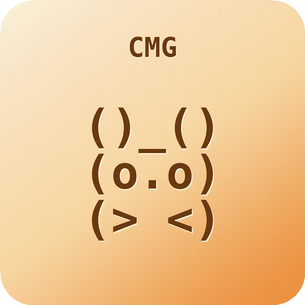
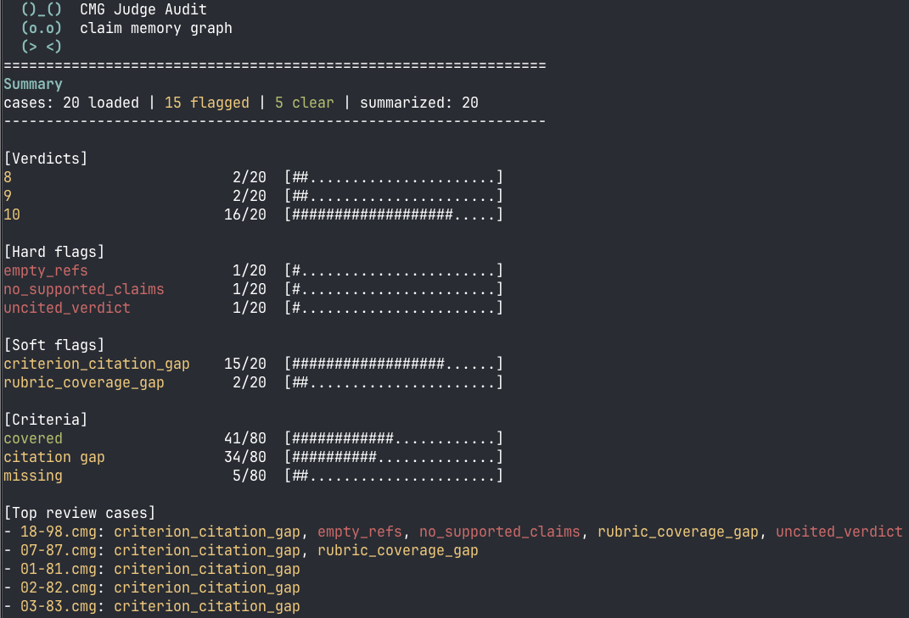

<p align="center">
  
</p>

<p align="center">
  <a href="https://pypi.org/project/claim-memory-graph/"></a>
  <a href="https://pepy.tech/project/claim-memory-graph"></a>
</p>

# CMG - Claim Memory Graph

I built CMG out of a practical need because as a PhD student studying how to evaluate AI systems, I sometimes use model-based graders in my experiments, which means relying on a language model as a judge. The problem is that those judges gave me too little control and clarity over their decisions. You cannot tell whether the judge actually checked your criteria or simply ignored the evidence you gave it. CMG try to closes that gap by making the judge back up each verdict with explicit claims and tying every claim to the evidence behind it. A set of plain checks then flags the cases where the verdict does not hold up, without putting a second model in the loop. It will not tell you who is right, but it will tell you which verdicts you can "trust" and which ones a person should read.

## Why

LLM judges are useful, but they are not neutral. Researchers keep finding the same failure modes.

- Zheng et al. report position bias, verbosity bias, self-enhancement bias, and limited reasoning.
- Li et al. show scoring bias from rubric order, score ids, and reference answer scoring.
- Feng et al. show that explicit rubrics and criteria can help judge consistency, but do not solve it.
- Wang et al. show weak evidence verification in research-agent judging.
- Chen et al. show reliability gaps for long-form outputs, even when rubrics or references are present.

CMG does not pretend to fix these biases, but it does make them easy to spot. You tell the judge what to check by passing the task, the answer, an optional reference, the rubric, and the criteria, and CMG saves all of that as evidence for the judge to make claims against. Each verdict then has to rest on real claims, and each claim has to point back to a piece of that evidence, so when the judge cuts a corner the viewer flags it, whether that is missing evidence, an ignored reference, a rubric item nobody checked, a bad verdict, or an unsafe verdict change.

For now the local viewer is the dashboard.

```bash
cmg-view cmg-runs/*.cmg.jsonl --flagged-only
```

A web dashboard can read the same report data later.

## When to use CMG

Use CMG when you run an LLM judge and cannot just trust what it says.

- **Large eval runs.** You score thousands of cases and cannot read every explanation by hand, so CMG flags the ones that need a human and lets you skip the rest.
- **Reference checks.** You want to catch a verdict that never cited the gold answer (`reference_ignored`).
- **Rubric coverage.** You need every criterion checked, not quietly skipped (`rubric_coverage_gap`).
- **Audit and debugging.** You want a replayable trail for each decision, so you can explain a score or work out why scores drift between runs.
- **Multi-turn judging.** You need to catch a verdict that flipped without a proper retraction (`verdict_flip_without_invalidation`).

CMG will not tell you whether the judge is right, because that call still belongs to a person. What it does check is whether the judge backed its verdict, covered your rubric, and stayed consistent, and it points you at the cases where it did not.

## Install

```bash
pip install claim-memory-graph
```

Optional provider helpers:

```bash
pip install 'claim-memory-graph[openai]'
pip install 'claim-memory-graph[anthropic]'
```

The distribution is named `claim-memory-graph`, but you import it as `cmg`. The core package has no runtime dependencies.

## Quickstart

Start with the local demo. It needs no API key.

```bash
python examples/local_judge_demo.py
cmg-view cmg-runs/*.cmg.jsonl --summary
cmg-view cmg-runs/*.cmg.jsonl --show-evidence
cmg-view cmg-runs/*.cmg.jsonl --flagged-only
```

The `--summary` view gives you the whole run at a glance.

<p align="center">
  
</p>

Once that runs, wire CMG into your own judge. You keep the main task and the rubric. CMG only adds the audit layer.

```python
from pathlib import Path

from cmg import ClaimGraph, JsonlStorage, arun_judge, judge_report


async def judge_fn(messages):
    return await call_your_judge_model(messages)


async with ClaimGraph(JsonlStorage(Path("cmg-runs/case-1.cmg.jsonl"))) as graph:
    result = await arun_judge(
        graph,
        judge_fn,
        prompt="Question shown to the candidate model.",
        candidate_output="Candidate model answer.",
        reference_answer="Optional gold answer.",
        rubric="How the judge should decide.",
        criteria=("Correctness", "Completeness"),
        verdicts=("pass", "fail"),
    )

    report = judge_report(graph)

if result.decision is None:
    print("The judge returned a missing or invalid verdict.")
else:
    print(result.decision.content)

print(report["human_review_flags"])
```

## What the judge must return

The judge's visible answer has to start with a verdict line.

```text
VERDICT: pass
```

It should also add a hidden CMG block with its claims.

````text
```cmg
{"ops": [{"op": "commitment", "content": "The answer matches the reference.", "refs": ["s-..."]}]}
```
````

CMG records the final `Decision` itself, so if the model sends a `decision` op, `arun_judge` ignores it. And if the model returns `maybe` when only `pass` and `fail` are allowed, CMG records no decision and the report marks the case for human review.

## What you get

`judge_report(graph)` returns these fields.

- `verdict`
- `claims`
- `criteria`
- `judge_responses`
- `verdict_errors`
- `retracted`
- `human_review_flags`
- `violations`

Flags come in two kinds. Hard flags are real failures in the audit. Soft flags are gentler, just things to review. Here are the ones you will use most.

| Flag | Meaning |
|---|---|
| `missing_verdict` | The judge did not return a valid verdict line. |
| `invalid_verdict` | The verdict was not in the allowed list. |
| `uncited_verdict` | A verdict has no active cited claims. |
| `no_supported_claims` | No active claim has valid evidence. |
| `criterion_citation_gap` | A criterion was discussed or may be covered, but no active claim cited that exact criterion id. |
| `rubric_coverage_gap` | A criterion does not appear to be covered by any active claim text. |
| `reference_ignored` | A reference answer exists, but no active claim cites it. |
| `verdict_flip_without_invalidation` | A verdict changed without retracting old claims first. |
| `silent_commitment_drop` | A later decision dropped an active claim without a retraction. |

## Integrations

CMG does not replace your eval framework. It sits inside it. Keep using the framework for datasets, model calls, scores, and totals. Let CMG hold the per-case audit log. Each example below is a small adapter you can drop into one common setup.

- **DeepEval.** Wrap `arun_judge` in a custom metric. `examples/deepeval_metric.py` subclasses `BaseMetric`, so each `measure` call writes a per-case `.cmg.jsonl`, turns the verdict into a score, and puts the CMG path and review flags in the metric's `reason`.
- **Inspect AI.** Register a `@scorer` that runs the judge. `examples/inspect_ai_scorer.py` returns an Inspect `Score` and keeps the CMG graph path, review flags, and claims in the score metadata, so the audit data rides along with every sample.
- **OpenAI, or any provider.** For a judge with no framework around it, `examples/openai_judge_demo.py` passes `make_openai_llm_fn(...)` straight in as the `judge_fn`. CMG does not care which provider sits behind it.

Use a fresh output file for each case run. Do not append many runs of the same case to one JSONL file.

## Docs

| Topic | Link |
|---|---|
| User guide | [docs/user-guide.md](docs/user-guide.md) |
| Developer guide | [docs/dev-guide.md](docs/dev-guide.md) |
| Release checklist | [docs/release.md](docs/release.md) |

_These docs, this README included, were drafted with AI and reviewed by hand._

## Sources

- [Zheng et al., Judging LLM-as-a-Judge with MT-Bench and Chatbot Arena](https://arxiv.org/abs/2306.05685)
- [Li et al., Evaluating Scoring Bias in LLM-as-a-Judge](https://arxiv.org/abs/2506.22316)
- [Feng et al., Are We on the Right Way to Assessing LLM-as-a-Judge?](https://arxiv.org/abs/2512.16041)
- [Wang et al., Time to REFLECT: Can We Trust LLM Judges for Evidence-based Research Agents?](https://arxiv.org/abs/2605.19196)
- [Chen et al., Benchmarking LLM-as-a-Judge for Long-Form Output Evaluation](https://arxiv.org/abs/2606.01629)

## License

Apache-2.0.
