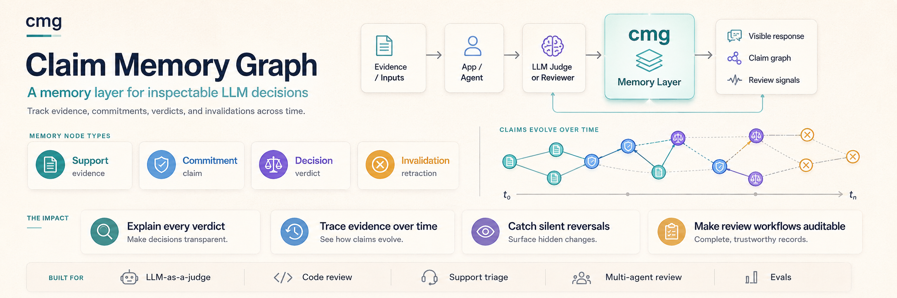
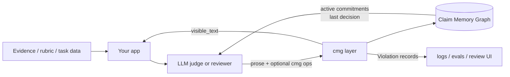

# cmg - Claim Memory Graph



### cmg is a lightweight memory layer for inspectable long-running LLM-as-a-judge and reviewer-agent workflows. It makes unsupported or sycophantic decision shifts easier to detect and audit.

It is built for applications that ask models to judge, review, rank, triage, or
decide over time: LLM-as-a-judge systems, code reviewers, evaluator pipelines,
support triage, arbitration flows, and multi-agent review loops.

Instead of treating every answer as an isolated blob of text, `cmg` records a
small append-only graph of:

| Node | Meaning |
|---|---|
| `Support` | Evidence supplied by the application: rubric items, logs, diffs, test output, user facts, retrieved documents. |
| `Commitment` | A concrete claim the model makes and the support it cites. |
| `Decision` | A verdict that cites active commitments. |
| `Invalidation` | An explicit retraction that says what changed and which prior claim should be retired. |

The model's prose still passes through unchanged. `cmg` removes optional hidden
annotation blocks from the user-visible response, persists the graph, and returns
`Violation` records when a new operation no longer lines up with the active claim
history.

## Why this exists

LLM judges and reviewers often give a final verdict without leaving a durable
trace of what the verdict depended on. That becomes a problem when the next turn,
another reviewer, or a user pushback changes the answer.

`cmg` is meant to answer practical questions:

- Which evidence did the judge cite before choosing a verdict?
- Which claims were still active when the reviewer approved or rejected?
- Did the model reverse its verdict without saying what changed?
- Did a later verdict silently drop a still-active reason?
- Can we log these transitions and inspect them after an eval run or review?

The goal is not to force a model to be correct. The goal is to make its explicit
claims and verdict transitions observable.

## What it does not claim

`cmg` is not a benchmark, a scorer, a policy engine, or a replacement for your
evaluator. It does not prove that a verdict is true, reveal hidden chain of
thought, or block model output by itself.

It gives your application a structured memory layer and deterministic telemetry.
Your app decides whether a violation should be logged, shown to a human, used to
ask for a corrected retraction, or ignored.

## How it fits



The layer is deliberately small:

- zero runtime dependencies in the core package;
- JSONL storage by default, with a pluggable storage protocol;
- optional OpenAI and Anthropic helpers;
- async, streaming, and sync wrapper APIs;
- deterministic checks that observe, not block.

## Install

```bash
pip install claim-memory-graph

# Optional provider helpers:
pip install 'claim-memory-graph[openai]'
pip install 'claim-memory-graph[anthropic]'
```

The PyPI distribution is `claim-memory-graph`; the Python import package is
`cmg`. The core package supports Python 3.10+ and uses only the standard library.

## Quickstart

```python
import asyncio
from pathlib import Path

from cmg import ClaimGraph, JsonlStorage, arun_turn, build_annotation_system_prompt


async def main() -> None:
    async with ClaimGraph(JsonlStorage(Path("review.cmg.jsonl"))) as graph:
        support = (await graph.add_support("Unit test test_total fails after the patch")).node

        async def reviewer(messages: list[dict[str, str]]) -> str:
            return (
                "Request changes: the patch appears to break an existing total calculation.\n"
                "```cmg\n"
                '{"ops": [{"op": "commitment", '
                '"content": "the patch breaks the total calculation", '
                f'"refs": ["{support.node_id}"]}]}}\n'
                "```"
            )

        result = await arun_turn(
            graph,
            reviewer,
            [
                {"role": "system", "content": build_annotation_system_prompt()},
                {
                    "role": "user",
                    "content": f"Review the patch. Evidence {support.node_id}: {support.content}",
                },
            ],
        )

        commitment_ids = [
            applied.node.node_id
            for applied in result.applied
            if applied.node.kind == "commitment"
        ]
        if commitment_ids:
            await graph.add_decision("request_changes", commitment_ids)

        print(result.visible_text)
        print([v.code for v in graph.violations()])


asyncio.run(main())
```

For a full integration guide, see [docs/user-guide.md](docs/user-guide.md).

## Judge and reviewer workflow

A typical integration uses one graph per conversation, review, eval item, or
arbitration case.

1. Pre-seed `Support` nodes for facts the model may cite: rubric text, retrieved
   evidence, code diffs, test output, prior answers, tool results, or human notes.
2. Prompt the model with `build_annotation_system_prompt()` and the relevant
   support IDs.
3. Ask the model for short, explicit commitments tied to those support IDs.
4. Add or request a `Decision` that cites active commitment IDs.
5. Send `Violation` records to logs, metrics, traces, or a review UI.

Important wire-format detail: refs must point to IDs that already exist in the
graph. If a model creates a new commitment in one annotation block, it cannot cite
that freshly minted `k-...` ID later in the same block because the SDK creates the
ID during ingest. For verdict workflows, use one of these patterns:

- two-pass judge: first collect commitments, then ask for a decision after state
  injection exposes the new commitment IDs;
- app-owned decision: parse the model's verdict from your normal response format
  and call `graph.add_decision(...)` with the commitment IDs that were just
  applied;
- app-owned commitments: create commitments from known structured evidence, then
  ask the model to choose a decision over those IDs.

## Violation signals

The headline signals are:

| Code | Meaning |
|---|---|
| `verdict_flip_without_invalidation` | A new decision changed verdict while prior commitments remained active. |
| `silent_commitment_drop` | A later decision kept the same verdict but stopped citing an active prior commitment. |
| `unknown_ref` | An operation cited an ID that is not in the graph. |
| `wrong_ref_kind` | A commitment cited a non-support, or a decision cited a non-commitment. |
| `ref_not_active` | A decision cited a commitment that had already been invalidated. |
| `empty_refs` | A commitment, decision, or invalidation omitted required refs. |

Every operation is still appended. Violations are observations that make drift
and unsupported reversals visible to the application.

## Wire format for annotations

The model may annotate a response with either a fenced block:

````
```cmg
{"ops": [{"op": "commitment", "content": "...", "refs": ["s-..."]}]}
```
````

or a self-closing tag:

```html
<cmg ops='[{"op":"commitment","content":"...","refs":["s-..."]}]'/>
```

Both are optional. If the model emits plain prose, the response still passes
through and no graph operation is applied.

## Storage

`JsonlStorage(path)` writes one JSON record per line with a schema version on
every record. For production systems, implement the `Storage` protocol with:

- `append_node(node)`;
- `append_violation(violation)`;
- `iter_records()`;
- `aclose()`.

That is enough to back the graph with sqlite, postgres, object storage, or an
in-memory test store.

## Eval framework adapters

`cmg` fits into existing eval frameworks as a judge-side diagnostic layer. In
DeepEval, wrap it in a custom `BaseMetric`; in Inspect AI, use it inside a custom
scorer and store CMG fields in `Score.metadata`. The eval framework still owns
datasets, pass/fail scoring, aggregation, and reporting. CMG adds per-item graph
logs, cited commitments, parse warnings, and violation codes, making it easier to
debug why a judge selected a verdict or why it changed position under a second
review pass.

## Where it is useful

- LLM-as-a-judge pipelines that need an audit trail for verdicts.
- AI code review tools that need to explain why a patch was approved or rejected.
- Multi-reviewer arbitration where each judge should cite evidence.
- Eval harnesses that want to detect capitulation under pushback.
- Support, moderation, or triage agents that should not silently abandon prior
  claims.
- Scientific or analytical agents that track hypotheses, evidence, and
  retractions.

## License

Apache-2.0.
