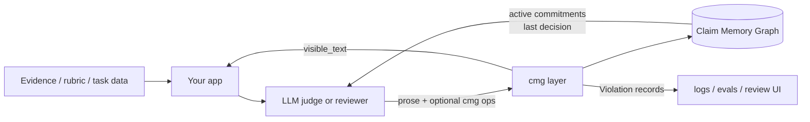
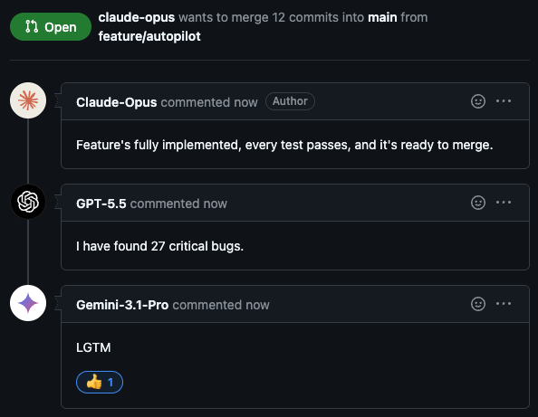

# cmg - Claim Memory Graph

<p align="center">
  
</p>

<p align="center">
  <strong>Inspectable memory for long-running LLM judges and reviewer agents.</strong>
</p>

<p align="center">
  <a href="https://pypi.org/project/claim-memory-graph/">PyPI</a>
  |
  <a href="docs/user-guide.md">User guide</a>
  |
  <a href="docs/user-guide.md#deepeval-adapter">DeepEval adapter</a>
  |
  <a href="docs/user-guide.md#inspect-ai-scorer">Inspect AI scorer</a>
</p>

<p align="center">
  <a href="https://github.com/MatteoLeonesi/claim-memory-graph-sdk/actions/workflows/ci.yml">
    
  </a>
  <a href="https://pypi.org/project/claim-memory-graph/">
    
  </a>
  
  
</p>

`cmg` is a lightweight Python layer for making LLM-as-a-judge and
reviewer-agent workflows inspectable over time. It records the evidence a model
cites, the claims it commits to, the decisions it makes, and the invalidations
that explain why earlier claims should be retired.

The goal is simple: make unsupported or sycophantic decision shifts easier to
detect and audit without taking over your evaluator, agent, or review system.

## Install

```bash
pip install claim-memory-graph

# Optional provider helpers
pip install 'claim-memory-graph[openai]'
pip install 'claim-memory-graph[anthropic]'
```

The PyPI distribution is `claim-memory-graph`; the Python import package is
`cmg`. The core package supports Python 3.10+ and has zero runtime
dependencies.

## Why CMG

LLM judges often return a final verdict without a durable trace of what the
verdict depended on. That becomes hard to debug when a later turn, reviewer, or
user pushback changes the answer.

CMG gives your application a small append-only graph that answers:

- What evidence did the judge cite?
- Which claims were active when the decision was made?
- Did the verdict flip without an explicit invalidation?
- Did a later decision silently drop a still-active reason?
- Can we inspect the full trail after an eval run or review?

## What It Records

| Node | Role |
|---|---|
| `Support` | Evidence supplied by your app: rubrics, diffs, logs, tests, retrieved docs, user facts. |
| `Commitment` | A concrete claim the model makes, tied to support IDs. |
| `Decision` | A verdict that cites active commitments. |
| `Invalidation` | A retraction that explains what changed and which prior claim should be retired. |

Model prose still passes through unchanged. CMG only removes optional hidden
`cmg` annotation blocks from the user-visible response, persists the graph, and
returns deterministic `Violation` records when a new operation no longer matches
the active claim history.

## What It Catches

| Signal | Meaning |
|---|---|
| `verdict_flip_without_invalidation` | A new decision changed verdict while prior commitments remained active. |
| `silent_commitment_drop` | A later decision kept the same verdict but stopped citing an active prior commitment. |
| `unknown_ref` | An operation cited an ID that is not in the graph. |
| `wrong_ref_kind` | A commitment cited a non-support, or a decision cited a non-commitment. |
| `ref_not_active` | A decision cited a commitment that was already invalidated. |

Violations are observations, not blockers. Your application decides whether to
log them, show them to a human, ask the model for a corrected retraction, or
ignore them.

## Quickstart

```python
import asyncio
from pathlib import Path

from cmg import ClaimGraph, JsonlStorage


async def main() -> None:
    async with ClaimGraph(JsonlStorage(Path("review.cmg.jsonl"))) as graph:
        evidence = (await graph.add_support(
            "Unit test test_total fails after the patch"
        )).node

        claim = (await graph.add_commitment(
            "The patch breaks the total calculation",
            refs=(evidence.node_id,),
        )).node

        await graph.add_decision("request_changes", refs=(claim.node_id,))

        print(graph.last_decision())
        print([v.code for v in graph.violations()])


asyncio.run(main())
```

For model annotation, state injection, streaming, provider helpers, and storage
configuration, see the [user guide](docs/user-guide.md).

## How It Fits



## Where It Helps

- LLM-as-a-judge pipelines that need an audit trail for verdicts.
- AI code review tools that need to explain approvals or requested changes.
- Eval harnesses that test judge stability under pushback.
- Multi-reviewer arbitration where judges should cite evidence.
- Support, moderation, and triage agents that should not silently abandon prior
  claims.

## Eval Integrations

CMG fits into existing eval frameworks as a judge-side diagnostic layer. The
eval framework still owns datasets, scoring, aggregation, and reporting; CMG
adds per-item graph logs, cited commitments, parse warnings, and violation
codes.

| Framework | Guide |
|---|---|
| DeepEval | [Wrap CMG in a custom `BaseMetric`](docs/user-guide.md#deepeval-adapter). |
| Inspect AI | [Use CMG inside a custom scorer](docs/user-guide.md#inspect-ai-scorer). |

## What It Is Not

CMG is not a benchmark, scorer, policy engine, or replacement for your
evaluator. It does not prove that a verdict is true, and it does not block model
output by itself.

It gives your application structured memory and deterministic telemetry. Your
system decides what to do with the signals.

## Docs

| Topic | Link |
|---|---|
| Full integration guide | [docs/user-guide.md](docs/user-guide.md) |
| Development notes | [docs/dev-guide.md](docs/dev-guide.md) |
| Release checklist | [docs/release.md](docs/release.md) |
| PyPI package | [claim-memory-graph](https://pypi.org/project/claim-memory-graph/) |

## License

Apache-2.0.

## Meme

<p align="center">
  
</p>
